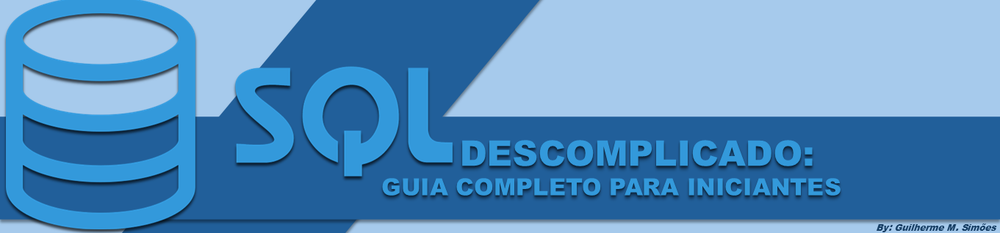

# Projeto Artigo - Santander 2024 [Fundamentos de IA para Devs]📖

Este repositório tem o intuito de disponibilizar aos usuários interessados o Artigo com o tema "SQL Descomplicado: Guia Completo para Iniciantes".

Espero que gostem! Aproveitem!😄💕

# ARTIGO📘 ***********************************************************

# O que é SQL: Origem e Usos
SQL (Structured Query Language) é uma linguagem de programação utilizada para gerenciar e manipular bancos de dados relacionais. Criada na década de 1970 pela IBM, SQL se tornou o padrão de fato para interagir com bancos de dados. Sua principal função é permitir que os usuários criem, modifiquem e consultem dados armazenados de forma eficiente. Desde grandes corporações até pequenas startups, SQL é amplamente utilizado em diversos setores, como finanças, saúde, tecnologia e muitos outros, devido à sua simplicidade e poder.

# Comandos Básicos de SQL e Exemplos de seus Usos
Os comandos básicos de SQL incluem SELECT, INSERT, UPDATE e DELETE. Eles são a espinha dorsal de qualquer operação com banco de dados.

- SELECT: Usado para buscar dados.  
SELECT * FROM clientes;

- INSERT: Insere novos dados.  
INSERT INTO clientes (nome, email) VALUES ('João', 'joao@email.com');

- UPDATE: Atualiza dados existentes.  
UPDATE clientes SET email = 'novoemail@email.com' WHERE nome = 'João';

- DELETE: Remove dados.  
DELETE FROM clientes WHERE nome = 'João';

Com esses comandos, você pode realizar as operações essenciais em qualquer banco de dados relacional.

# Aplicando o SQL no Nosso Dia a Dia
No cotidiano, SQL pode ser uma ferramenta poderosa para diversas tarefas. Se você trabalha em uma empresa, pode usar SQL para gerar relatórios de vendas, monitorar inventários ou analisar o comportamento do cliente. Por exemplo, com uma simples consulta SQL, você pode extrair todos os clientes que compraram um produto específico no último mês, ajudando a entender tendências de mercado. Além disso, com a popularização de ferramentas de BI (Business Intelligence), conhecimento em SQL permite que você extraia insights valiosos dos dados, contribuindo diretamente para a tomada de decisões estratégicas.

# Considerações Finais sobre SQL
SQL é uma habilidade indispensável no mundo moderno, onde a análise de dados é crucial para o sucesso de qualquer negócio. Sua facilidade de uso e a vasta gama de aplicações tornam essa linguagem essencial para profissionais de todas as áreas. Aprender SQL pode abrir portas para novas oportunidades e melhorar sua eficiência no trabalho. Não importa se você é um iniciante ou um profissional experiente, sempre há algo novo para descobrir no universo dos bancos de dados.

Gostou do conteúdo? É importante frizar que ele foi gerado 100% por uma **Inteligência Artificial (ChatGPT)**, e revisado por um humano, que por sinal possuí Linkedin, se lhe interessar visite-me, [**Guilherme Mancusi Simões**](https://www.linkedin.com/in/guilherme-mancusi-sim%C3%B5es-882873215/). Vamos aprender juntos e dominar o mundo com a tecnologia!

#SQL #BancodeDados #Programação #Tecnologia
# ***********************************************************

## Prompts Utilizados💻 
|    Ações      |      Prompt's |
| :-----------: | :-----------: |
| Título      | Crie 10 Headlines para nomes de artigos sobre o assunto "Banco de Dados - SQL"      |
| Conteúdo    | Escreva um artigo como se fosse um escritor de artigos de banco de dados especialista em SQL, seguindo as regras fornecidas abaixo.|
| Regras |{REGRAS} > Deve ser divido em blocos, sendo eles: - Explicação resumida sobre o que é, origem e usos de SQL. - Comandos Básicos de SQL e exemplos de seus usos. - Aplicando o SQL no nosso dia a dia. - Considerações finais sobre SQL. >Faça um call ro action para minhas redes sociais ao final. >Coloque 4 hashtags relacionadas ao assunto ao final. >No máximo 12 linhas por blocos de explicação; >Exemplos contam a parte das 12 linhas. >Linguagem para público leigo do assunto, tendo em vista que o intuíto é descomplicar. |

# 🤩 > Sobre - 

Projeto e Repositório desenvolvidos por,  
Guilherme Mancusi Simões  
👨‍💻 [Linkedin](https://www.linkedin.com/in/guilherme-mancusi-sim%C3%B5es-882873215/)
😸 [Github](https://github.com/GuiCrownguard)

